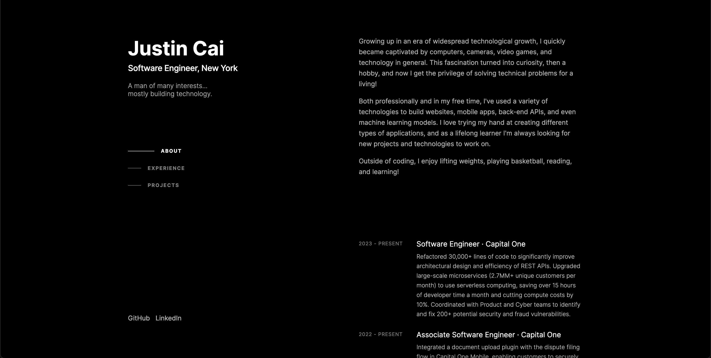

<div align='center'>
   
   <h1 align='center'>justinqcai/portfolio</h1>
   <a href='https://justincai.vercel.app'>
      
   </a>
</div>

This is the repository for my personal website! It was created with [Next.js](https://nextjs.org/) and [React](https://react.dev) and is currently deployed using [Vercel](https://vercel.com).

See the live site at [https://justincai.vercel.app/](https://justincai.vercel.app/)!

Inspired by [Brittany Chiang](https://github.com/bchiang7).

## Running Locally

First, run the development server:

```bash
npm run dev
# or
yarn dev
# or
pnpm dev
# or
bun dev
```

Open [http://localhost:3000](http://localhost:3000) to see the result!
